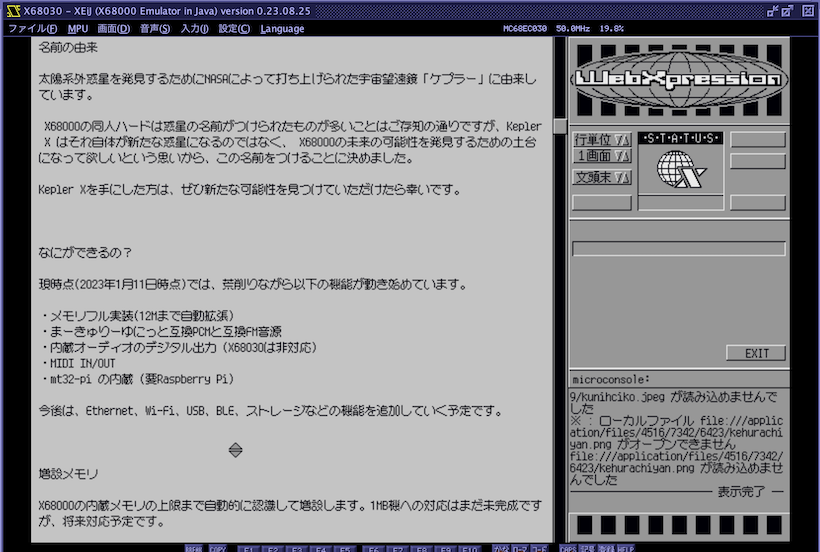

# mkfont12
True Type Font to X680x0 12dot font converter

### はじめに

患者長ひっくさんが作成された12dotビットマップフォント「マルミーニャ」が素晴らしく、ぜひX680x0環境で使いたいと思いコンバータをPythonで作成してみました。

「マルミーニャ」はBOOTHで頒布されています。BOOSTも可能です！
* [マルミーニャ](https://booth.pm/ja/items/4927023)

### インストール

これは Human68k/X680x0 用のプログラムではありません。

Pythonが導入されている状況で、pipを使って導入します。環境によってはpipではなくpip3を使う必要があるかもしれません。

    pip install git+https://github.com/tantanGH/mkfont12.git

Windowsユーザの方でPythonがはじめてという方はこちらも参照してください。

[Windowsユーザ向けPython導入ガイド](https://github.com/tantanGH/distribution/blob/main/windows_python_for_x68k.md)

### 使い方

    mkfont12 <True-Typeフォントファイル名> <x68k-12x12フォントファイル名>

環境により、True-Typeフォント(.ttf,.ttcなど)は絶対パスで指定する必要があります。

    mkfont12 x12y12pxMaruMinya.ttf MaruMinya.f12

出来上がった x68k 12x12フォントは 半角 + 全角(非漢字・第一水準・第二水準) のフルセットで 215,136 バイトであることが期待値です。

このデータを使うには小笠原博之さんの Hi-Speed Font Driver hfont.r が必要です。Vectorからダウンロード可能です。

[Hi-Speed Font Driver](https://www.vector.co.jp/soft/x68/writing/se027934.html)

    hfont.r MaruMinya.f12

のようにして 215,136 バイトのファイルを渡してあげればokです。

WebXpression や Ko-Window などで利用できます。

